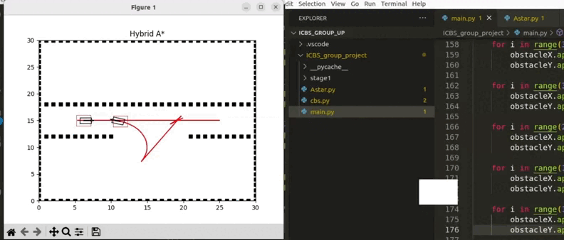

# Multi-agent-Motion-Planning-with-Improved-CBS-algorithms
This repository explores the essential area of multi-agent path planning for non-holonomic mobile robots. The goal is to design and implement ICBS (Improved Conflict-Based Search), which allows multiple agents to navigate environments, coordinating their movements effectively and avoiding collisions.

<!-- ABOUT THE PROJECT -->
## About The Project

This project addresses the domain of multi-agent path planning for Non-holonomic Mobile robots, specifically focusing on implementing ICBS (Improved Conflict-Based Search). The objective is to facilitate the seamless coordination of multiple agents navigating constrained spaces, ensuring operational efficiency, safety, and collision avoidance. The primary application area is pick and place operations within a warehouse, emphasizing precision, speed, and safety.

## Methods

- To accomplish this goal, we will be employing a 2D simulation environment (replicating real-world warehouse) and implement CBS and ICBS (Improvised Conflict-Based Search) that enables multiple agents to navigate environment, while avoiding collisions.
- We have employed Hybrid A star algorithm in 2D environment to plan paths for multi agents. Hybrid A star will be acting as the low-level algorithm for ICBS.
- We have implemented the algorithm which employs prioritized conflict resolution and disjoint splitting to enhance the path planning process.

Stages: a)Agents at initial position, b) Agent 1(left) is prioritized so agent 2 changed the path, c) Agent 2 planned a parallel optimum path for goal,
d) Agents at goal position, (Green dots shown illustrate the conflict locations resolved/ avoided while planning path

## How to run the code
Code  
── Multi-agent-Motion-Planning-with-Improved-CBS-algorithms/  
   ├── astar.py 
   ├── cbs.py 
   ├── main.py 
   └── README.md 

Requirements:
- numpy==1.20.3
- matplotlib==3.4.2
- heapdict==1.0.1
- scipy==1.7.0

run :
- python3 run main.py

ArgOS implementation is yet to be added.

## Results

Results are analyzed for two types of agents, holonomic and non-holonomic considering key points in motion planning performance check as follows:
* Path Optimality:
  * Paths found for holonomic agents were optimum paths for given start and goal locations after resolving conflicts.
  * Paths found for non-holonomic agents were suboptimum paths for given start and goal locations after resolving conflicts.
* Conflict resolving:
  * Paths found for holonomic as well as non-holonomic agents were without conflicts for all the cases with 100\% success.
* Completeness:
  * Paths found for holonomic agents guarantee finding a solution if one exist.
  * Paths found for non-holonomic agents doesnot guarantee finding a solution.

## Edge Cases

(<a href="#readme-top">back to top</a>)

