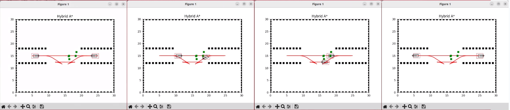
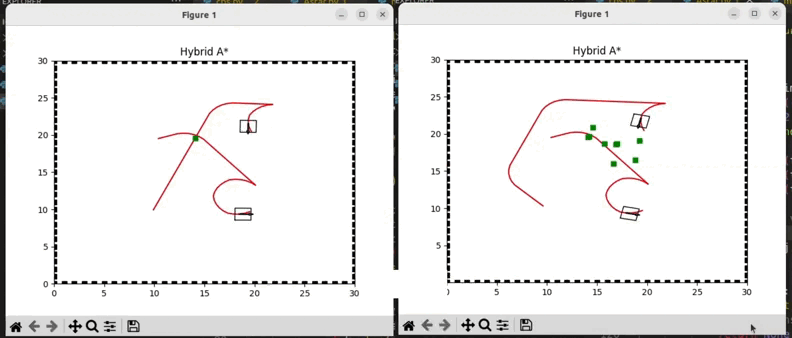

# Multi-agent-Motion-Planning-with-Improved-CBS-algorithms
This repository explores the essential area of multi-agent path planning for non-holonomic mobile robots. The goal is to design and implement ICBS (Improved Conflict-Based Search), which allows multiple agents to navigate environments, coordinating their movements effectively and avoiding collisions.

## Process

- To accomplish this goal, we will be employing a 2D simulation environment (replicating real-world warehouse) and implement CBS and ICBS (Improvised Conflict-Based Search) that enables multiple agents to navigate environment, while avoiding collisions.
- We have employed Hybrid A star algorithm in 2D environment to plan paths for multi agents. Hybrid A star will be acting as the low-level algorithm for ICBS.
- We have implemented the algorithm which employs prioritized conflict resolution and disjoint splitting to enhance the path planning process.

Stages: a)Agents at initial position, b) Agent 1(left) is prioritized so agent 2 changed the path, c) Agent 2 planned a parallel optimum path for goal,
d) Agents at goal position, (Green dots shown illustrate the conflict locations resolved/ avoided while planning path

## How to run the code
Code  
── Multi-agent-Motion-Planning-with-Improved-CBS-algorithms/  
   ├── astar.py 
   ├── cbs.py 
   ├── main.py 
   └── README.md 

Requirements:
- numpy==1.20.3
- matplotlib==3.4.2
- heapdict==1.0.1
- scipy==1.7.0

run :
- python3 run main.py

## Results Analysis

The results are analyzed for two types of agents, holonomic and non-holonomic, with key aspects of motion planning performance considered as follows:

### Path Optimality:
- For holonomic agents, the paths obtained were optimal for the given start and goal locations after resolving conflicts.
- For non-holonomic agents, the paths were suboptimal for the given start and goal locations, even after conflict resolution.

### Conflict Resolution:
- All paths for both holonomic and non-holonomic agents were conflict-free in every case, achieving 100% success.

### Completeness:
- Paths for holonomic agents ensure a solution is found if one exists.
- Paths for non-holonomic agents do not guarantee the discovery of a solution.

## Edge Cases

(<a href="#readme-top">back to top</a>)

